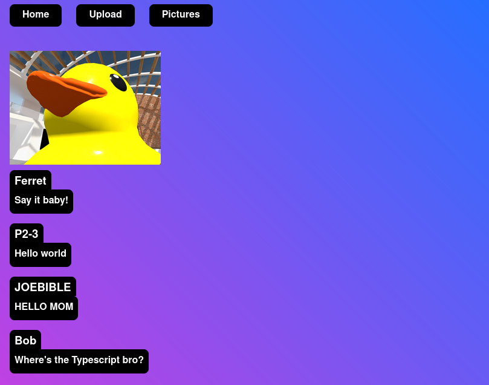
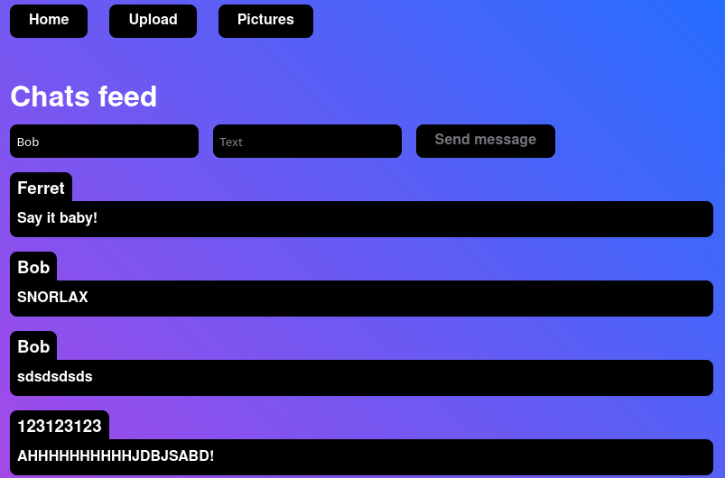

# p2-umbra-bear

> This project is just test of p2panda-js

Chat app frontend to made by following the [mushroom tutorial](https://p2panda.org/tutorials/mushroom-app) available on the p2panda handbook.

